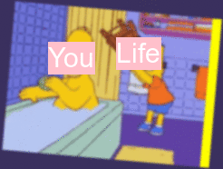

```{r setup, include=FALSE}
knitr::opts_chunk$set(echo = TRUE)
```

```{css}
h2 {color: #9F2B68;
    text-align: center;}

p {color: #F22A68;
  font-family: verdana;
  font-size: 20px;}
```


## My meme

"Life always becomes struggle when people feel relax."

The original photo is from The Simpsons, Homer represents person and Bart represents life.



    ```{r file='meme.R', eval=FALSE}

    ```

## My animated GIF

I cut 6 frames from The Simpsons and use these 6 frames to create a gif.


    ```{r file='animation.R', eval=FALSE}

    ```
