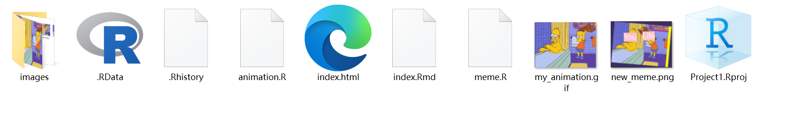
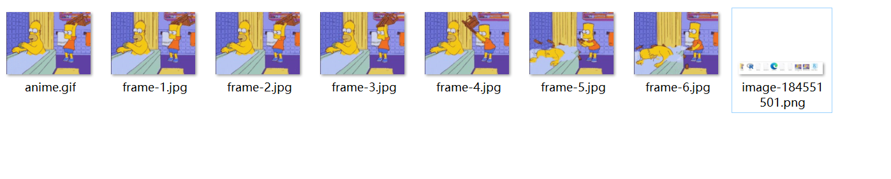

```{r setup, include=FALSE}
knitr::opts_chunk$set(echo = TRUE)
```

## *Project requirements*

github repo: <https://github.com/yuyubujue/stats220>

github page:<https://yuyubujue.github.io/stats220/>

project1



images



All of these files have been uploaded to <https://github.com/yuyubujue/stats220/tree/main/project1>

## 
